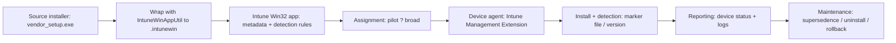

# 🚀 Intune Win32 App Deployment — Kyocera Cloud Print & Scan (Redacted)

  
**Status:** Production-ready templates • **Last updated:** 2025-10-19

> **Redaction notice:** This repository contains **fully redacted** implementation notes. All organization names, tenant identifiers, IPs, hostnames, subscription IDs, and user info have been intentionally removed. No secrets are present. ✅

---

## ✨ What is this?
A clean, enterprise-grade reference implementation for deploying a **third‑party desktop application** (e.g., *Kyocera Cloud Print & Scan*) as a **Win32 line-of-business app** via **Microsoft Intune**.  
The guide uses **marker‑file detection** as the primary method and provides **fallback detection by file version**. Example commands reflect a randomized product version (**v1.14.28321.0**) to avoid publishing real environment details.

---

## 🧭 Lifecycle at a glance

- 🧱 **Package**: Prepare installer + scripts → wrap with *IntuneWinAppUtil*  
- 🧪 **Detect**: Marker-file presence (primary) + app binary version (fallback)  
- 🔐 **Secure**: No creds in scripts, least-privileged roles, conditional assignments  
- 🚚 **Deliver**: Upload to Intune → Configure app metadata → Assign to pilot → Rollout  
- 📈 **Observe**: Monitor device install status, failures, and detection results  
- 🔁 **Maintain**: Supersedence for upgrades, uninstall flows, and rollback plan

---

## 🗺️ Architecture / Flow



---

## 📂 Repository layout

```
.
├── README.md
├── RUNBOOK.md
├── .gitignore
├── docs/
│   ├── OVERVIEW.md
│   ├── ARCHITECTURE.md
│   ├── CUTOVER_CHECKLIST.md
│   ├── ROLLBACK.md
│   └── SECURITY.md
└── scripts/
    ├── package/
    │   ├── build_package.ps1
    │   ├── install.cmd
    │   ├── uninstall.cmd
    │   ├── detection_marker.ps1
    │   ├── detection_fileversion.ps1
    │   └── appinfo.json
    └── deploy/
        ├── create_app_graph.ps1
        └── assign_app_graph.ps1
```

---

## 🔧 Quick start

1. Place the vendor installer in `scripts/package/` and update `appinfo.json`.
2. Run `scripts/package/build_package.ps1` to produce the `.intunewin`.
3. Upload in Intune: **Apps → Windows → Add → App type = Windows app (Win32)**.
4. Use `install.cmd` / `uninstall.cmd` and `detection_marker.ps1` (primary) or `detection_fileversion.ps1` (fallback).
5. Assign to a **pilot group**, validate, then **roll out**.
6. For automation, use the Graph placeholders under `scripts/deploy/` (fill your tenant values safely).

---

## ✅ Objectives & non‑objectives

- **Do:** provide production-ready docs, scripts, and structure you can adopt immediately.  
- **Don’t:** include real tenant data, secrets, or organization identifiers.

---

## 📜 License & attribution

- Content is provided as reference templates. Validate in a non‑production ring first.
- Product names are trademarks of their respective owners.
