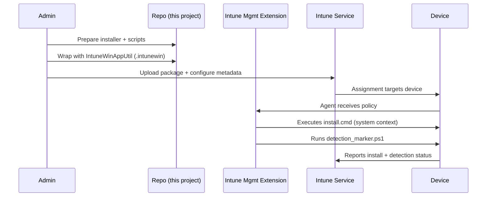

# ARCHITECTURE

```mermaid
sequenceDiagram
  participant Admin
  participant Repo as Repo (this project)
  participant IME as Intune Mgmt Extension
  participant Intune as Intune Service
  participant Device

  Admin->>Repo: Prepare installer + scripts
  Admin->>Repo: Wrap with IntuneWinAppUtil (.intunewin)
  Admin->>Intune: Upload package + configure metadata
  Intune->>Device: Assignment targets device
  Device->>IME: Agent receives policy
  IME->>Device: Executes install.cmd (system context)
  IME->>Device: Runs detection_marker.ps1
  Device->>Intune: Reports install + detection status
```
